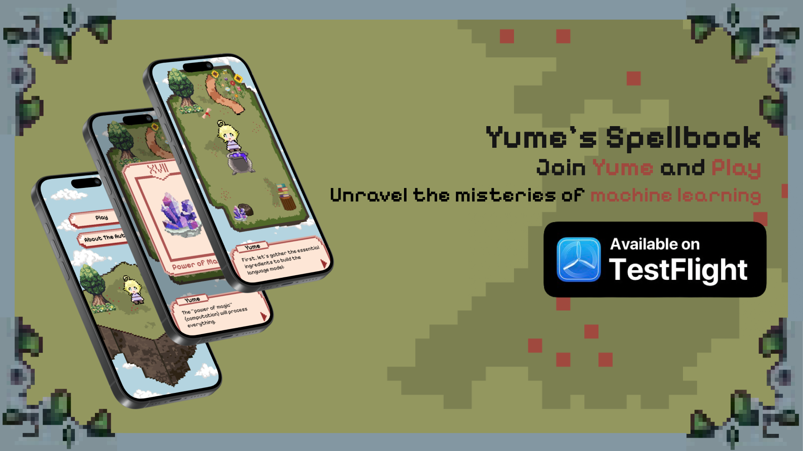

# Yume's Spellbook

**Yume's Spellbook** is a magical and playful interactive experience that helps non-experts understand how Large Language Models (LLMs) work. Through its narrative, the project fosters trust by clarifying the capabilities, limitations, and potential issues of LLMs. It aims to make complex concepts more accessible and engaging through a fun and educational journey.

## Sound Effects
Sound effects used in this project were obtained from [Zapsplat](https://www.zapsplat.com).

## Libraries and Tools Used

### swift-coreml-transformers
This project utilizes the [swift-coreml-transformers](https://github.com/huggingface/swift-coreml-transformers) open-source library by Hugging Face, licensed under the **Apache-2.0 License**.

### Fonts
The font used in all scenes is **Pixelify**, available through Google Fonts:
[Pixelify Font](https://fonts.google.com/share?query=pixelify).

## Tools and Resources

### Websites Frequently Utilized:
- **[Aseprite](https://www.aseprite.org/):** Primary platform for creating all pixel art assets.
- **[Figma](https://www.figma.com/):** Key tool for prototyping and designing the project.
- **[Apple Developer Documentation](https://developer.apple.com/documentation/):** Go-to resource for resolving coding issues.

## Credits

All aspects of this project, including design, coding, and illustration, were executed by **Larissa Okabayashi**.

### Special Thanks:
I want to express my heartfelt gratitude to my family, friends, and mentors for their invaluable guidance and support throughout this project.

## License
This project is licensed under the **MIT License**.
